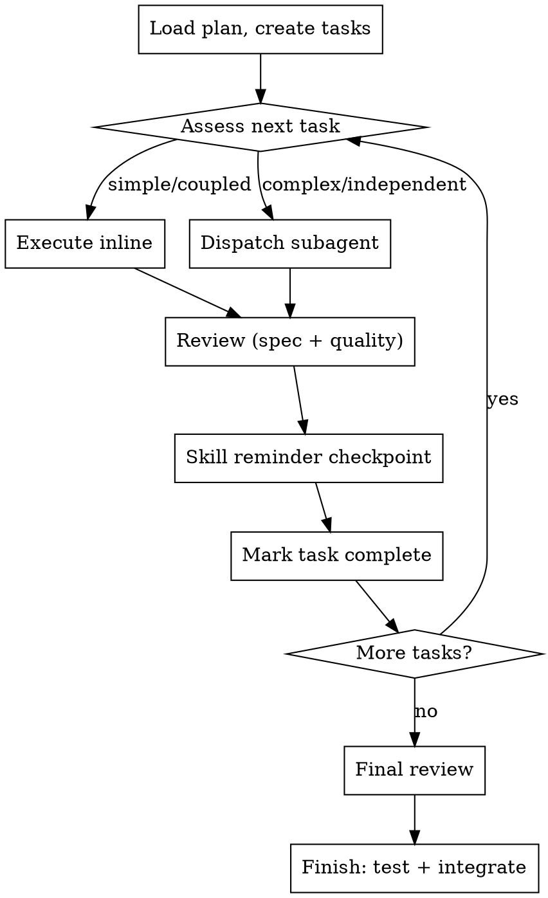

# Executing Plans

Execute an implementation plan by reading it, creating tasks, and working through them — choosing inline execution or subagent dispatch per task based on complexity. Review after each task. Finish with test verification and integration options.

**Announce at start:** "I'm using the executing-plans skill to implement this plan."

## The Process



## Step 1: Load and Review Plan

1. Read the plan file
2. Review critically — identify any questions or concerns
3. If concerns: raise them with the user before starting
4. Extract all tasks with full text and context
5. Create a task list for tracking

## Step 2: Execute Tasks

For each task:

### Assess: Inline or Subagent?

| Signal | Inline | Subagent |
|--------|--------|----------|
| Touches 1-2 files, simple change | Yes | |
| Well-specified, independent task | | Yes |
| Tightly coupled to previous task's output | Yes | |
| Complex, multi-file, isolated scope | | Yes |
| Context is getting large | | Yes |
| Only 1-2 tasks in entire plan | Yes | |

These are guidance, not hard rules. Use judgment.

### Inline Execution

1. Mark task as in_progress
2. Invoke `dev-utils:test-driven-development` if the task involves code
3. Follow each step exactly (plan has bite-sized steps)
4. Run verifications as specified
5. Self-review against the spec after completing

### Subagent Execution

1. Mark task as in_progress
2. Dispatch implementer using `subagent_type: "implementer"`. Provide in the prompt:
   - Full task text — never make subagent read plan file
   - Scene-setting context (where this fits, dependencies)
   - Working directory
3. Handle implementer status:
   - **DONE:** Proceed to review
   - **DONE_WITH_CONCERNS:** Read concerns. If about correctness/scope, address before review. If observations, note and proceed.
   - **NEEDS_CONTEXT:** Provide missing context and re-dispatch
   - **BLOCKED:** Assess blocker — provide more context, or escalate to user if plan itself is wrong
4. Dispatch spec compliance reviewer using `subagent_type: "spec-reviewer"`. Provide in the prompt:
   - Full task requirements text
   - What the implementer claims they built (from their report)
   - If issues found: implementer fixes, reviewer re-reviews, repeat until approved
5. Dispatch code quality reviewer using `subagent_type: "code-quality-reviewer"`. Provide in the prompt:
   - What was implemented (from implementer's report)
   - Plan/requirements reference
   - Base and head SHAs for the diff
   - If issues found: implementer fixes, reviewer re-reviews, repeat until approved

**Never:**
- Dispatch multiple implementation subagents in parallel (they'll conflict)
- Skip review loops (reviewer found issues = not done)
- Start code quality review before spec compliance passes
- Accept "close enough" on spec compliance

### After Each Task

1. Mark task complete
2. **Skill reminder:** Before starting the next task, check if any dev-utils skills apply to the upcoming work.

## Step 3: Final Review

After all tasks complete, use `dev-utils:requesting-code-review` to dispatch the `code-reviewer` subagent over the entire implementation (base = the plan's starting commit, head = current HEAD). Verify all requirements from the plan are met.

## Step 4: Finish

1. Run the project's full test suite and verify it passes
2. Present exactly these options:

```
Implementation complete. What would you like to do?

1. Merge back to <base-branch> locally
2. Push and create a Pull Request
3. Keep the branch as-is (I'll handle it later)
4. Discard this work
```

3. Execute chosen option:
   - **Merge locally:** checkout base branch, pull latest, merge, verify tests on merged result, delete feature branch
   - **Create PR:** push branch, create PR via `gh pr create`
   - **Keep as-is:** report branch name and location, done
   - **Discard:** require typed "discard" confirmation first, then delete branch

4. Clean up worktree if applicable (options 1 and 4 only)

## When to Stop and Ask

**Stop executing immediately when:**
- Hit a blocker (missing dependency, unclear instruction)
- Plan has critical gaps
- Verification fails repeatedly
- You don't understand an instruction

Ask for clarification rather than guessing.

## Integration

**Required workflow skills:**
- **dev-utils:writing-plans** — creates the plan this skill executes
- **dev-utils:test-driven-development** — used during inline execution (injected automatically into implementer agent via skills field)
- **dev-utils:requesting-code-review** — holistic diff-based review; used for the final review in Step 3

**Agents used:**
- `implementer` — executes task, writes code/tests, self-reviews, reports status
- `spec-reviewer` — read-only; verifies implementation matches spec
- `code-quality-reviewer` — read-only; verifies code quality and design
- `code-reviewer` — read-only; holistic diff-based review for the final pass
